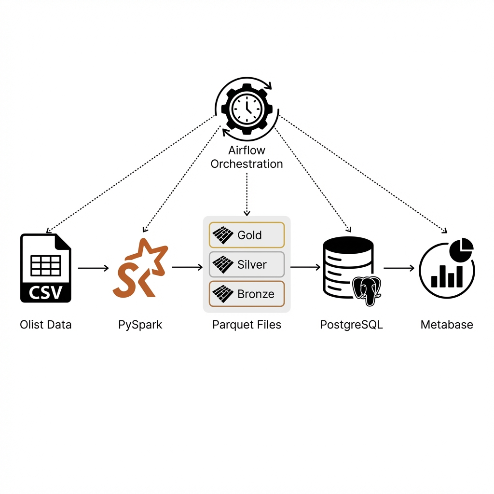
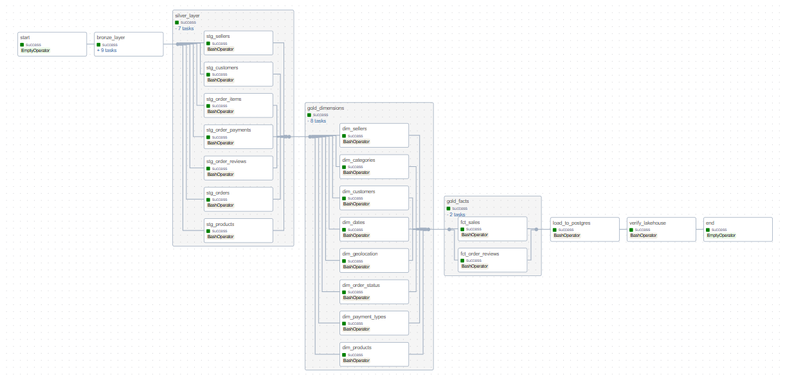
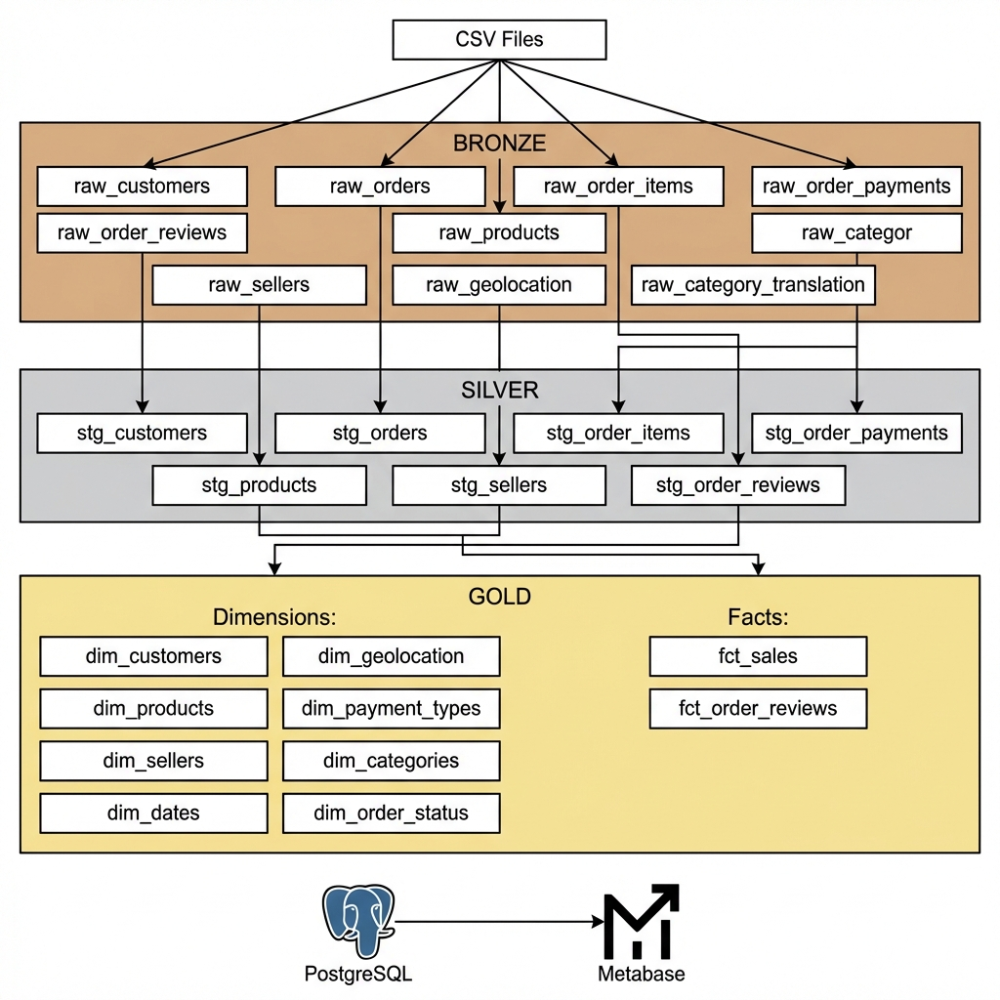

# E-commerce Data Lakehouse

## 📌 Introduce
Dự án xây dựng Data Lakehouse cho phân tích dữ liệu E-commerce sử dụng Olist dataset (Brazil).
Pipeline xử lý data theo kiến trúc Medallion (Bronze → Silver → Gold) với PySpark và Airflow.

**Technologies:**
- **Apache Spark** - Distributed data processing
- **Apache Airflow** - Workflow orchestration
- **Parquet** - Columnar storage format
- **PostgreSQL** - Data warehouse
- **Metabase** - Data visualization
- **Docker** - Containerization

---

## 🏗️ Architecture



---

## 🔄 Pipeline Orchestration

Pipeline được điều phối bởi **Apache Airflow** với 27 tasks:

| Task Group | Tasks | Description |
|------------|-------|-------------|
| **Bronze Layer** | 9 tasks | Extract CSV → Parquet |
| **Silver Layer** | 7 tasks | Clean & standardize data |
| **Gold Dimensions** | 8 tasks | Create dimension tables |
| **Gold Facts** | 2 tasks | Create fact tables |
| **Load to PostgreSQL** | 1 task | Export Gold → PostgreSQL |

**DAG Features:**
- Schedule: Daily @ 6:00 AM
- Sequential execution để tránh Spark conflicts
- TaskGroups cho visual organization



---

## 📊 Data Quality - Medallion Architecture

###### 🥉 **Bronze Layer**
Đây là nơi đầu tiên tiếp nhận dữ liệu thô. Dữ liệu chưa được xử lý, giữ nguyên format gốc.
- 9 tables từ Olist dataset
- Format: Parquet với metadata (`_extracted_at`, `_source_file`)
- Strategy: **Append** (thêm mới, không thay đổi dữ liệu cũ)

###### 🥈 **Silver Layer**
Sau khi clean, validation và standardization, dữ liệu được chuyển đến Silver Layer.
- 7 staging tables (`stg_*`)
- Transformations: TRIM, type casting, standardize locations
- Strategy: **Overwrite** (ghi đè với dữ liệu mới nhất)

###### 🥇 **Gold Layer**
Giai đoạn cuối cùng, dữ liệu được aggregate và model theo Star Schema.
- 8 Dimensions: `dim_customers`, `dim_products`, `dim_sellers`, `dim_dates`, etc.
- 2 Facts: `fct_sales`, `fct_order_reviews`
- Strategy: **Upsert** (update nếu tồn tại, insert nếu mới)

---

## 📂 Project Structure

```
ecommerce-lakehouse/
├── airflow/                  # Airflow DAGs
│   └── dags/
│       └── ecommerce_pipeline_dag.py
├── spark/                    # PySpark applications
│   └── apps/
│       ├── extract_bronze.py      # CSV → Bronze Parquet
│       ├── transform_silver.py    # Bronze → Silver
│       ├── transform_gold.py      # Silver → Gold
│       └── load_gold_to_postgres.py
├── data/                     # Raw data + Lakehouse output
│   ├── raw/olist/            # Input CSV files
│   └── lakehouse/            # Output Parquet files
├── init-scripts/             # PostgreSQL initialization
├── docker-compose.yml        # Container orchestration
└── README.md
```

---

## 🚀 Getting Started

### Prerequisites
- Docker & Docker Compose
- 8GB RAM minimum

### 1. Clone and Setup
```bash
git clone https://github.com/yourusername/ecommerce-lakehouse.git
cd ecommerce-lakehouse
```

### 2. Prepare Data
Download Olist dataset from [Kaggle](https://www.kaggle.com/datasets/olistbr/brazilian-ecommerce) và đặt vào `data/raw/olist/`.

### 3. Start Services
```bash
docker-compose up -d
```

### 4. Access Services
| Service | URL | Credentials |
|---------|-----|-------------|
| Airflow | http://localhost:8080 | airflow / airflow |
| Metabase | http://localhost:3000 | Setup on first access |
| PostgreSQL | localhost:5432 | lakehouse / lakehouse123 |

### 5. Trigger Pipeline
```bash
docker exec -u airflow lakehouse_airflow airflow dags trigger ecommerce_lakehouse_pipeline
```

---

## 📈 Dashboard

Dashboard được thiết kế với 5 tabs:

### 1. Executive Overview
KPIs tổng quan: Total Revenue, Orders, Customers, AOV


### 2. Sales Analytics
Phân tích doanh thu theo category, state, trend


### 3. Customer Intelligence
Hành vi khách hàng, phân bố địa lý


### 4. Seller Performance
Hiệu suất và xếp hạng người bán


### 5. Operations & Quality
Delivery performance, customer satisfaction


---

## 📝 Loading Strategy

| Layer | Strategy | Description |
|-------|----------|-------------|
| Bronze | **Append** | Thêm dữ liệu mới, không thay đổi dữ liệu cũ |
| Silver | **Overwrite** | Ghi đè với dữ liệu đã được clean |
| Gold | **Upsert** | Update nếu tồn tại, Insert nếu mới |

---

## 🔗 Data Lineage



---

## 📊 Dataset

**Olist Brazilian E-Commerce Dataset**
- Source: [Kaggle](https://www.kaggle.com/datasets/olistbr/brazilian-ecommerce)
- Records: ~100K orders
- Period: 2016-2018
- Tables: 9 CSV files

---

## 🛠️ Tech Stack

| Category | Technology |
|----------|------------|
| ETL | Apache Spark (PySpark) |
| Orchestration | Apache Airflow |
| Storage | Parquet |
| Database | PostgreSQL |
| Visualization | Metabase |
| Container | Docker Compose |

---

## 📄 License

MIT License
